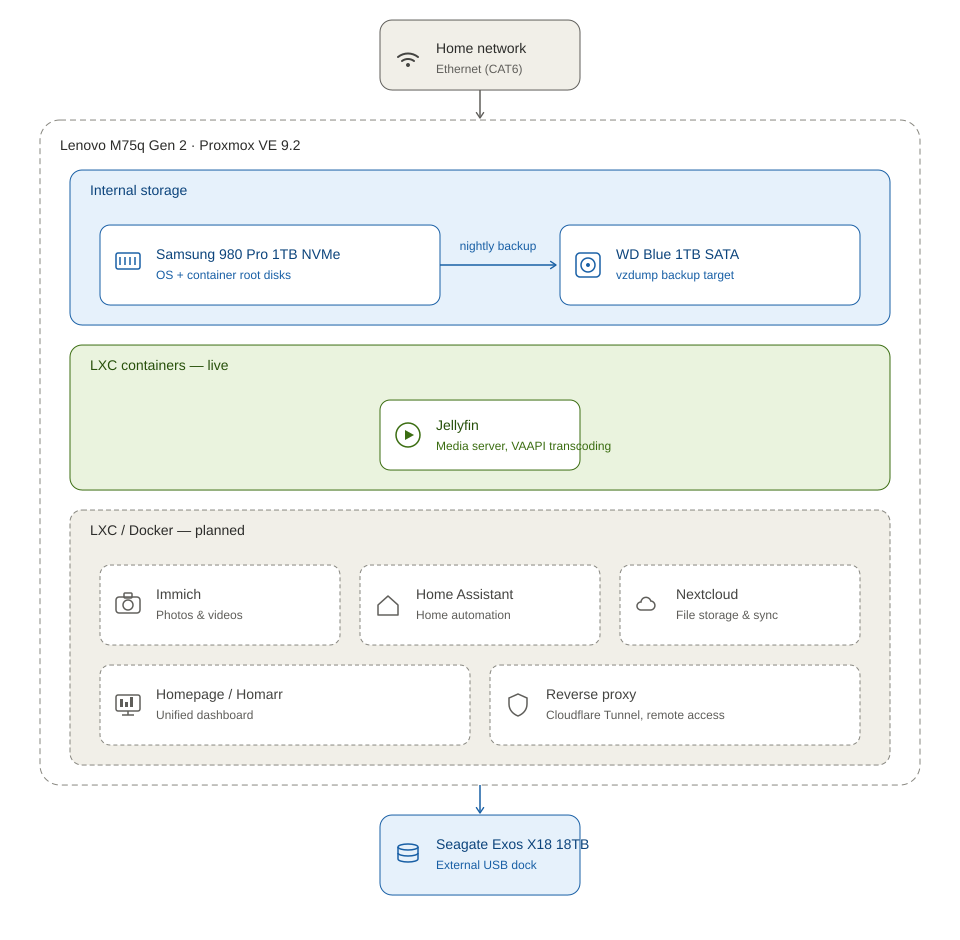

# Homelab Server — Lenovo ThinkCentre M75q Gen 2 Tiny

A general-purpose Proxmox VE homelab built on a low-power Tiny PC. The goal is a flexible platform for media serving, home automation, and personal research / experimentation.

## Overview

| | |
|---|---|
| **Host** | Lenovo ThinkCentre M75q Gen 2 Tiny |
| **CPU** | AMD Ryzen 5 PRO 4650GE (6C/12T, integrated Vega graphics) |
| **RAM** | 32GB (2×16GB DDR4-3200 SO-DIMM, dual channel) |
| **Hypervisor** | Proxmox VE 9.2 (Debian 13 "Trixie") |
| **Primary storage** | Samsung 980 Pro 1TB NVMe (PCIe 3.0 x4) |
| **Backup storage** | WD Blue 1TB, 2.5" SATA (internal) |
| **Media storage** | Seagate Exos X18 18TB (external, USB dock) |

## Architecture

> Jellyfin is the only container live today (solid green). Immich, Home Assistant, Nextcloud, the dashboard, and the reverse proxy are planned next steps (dashed gray) — each will move into its own "live" section as it's deployed.

## Storage layout

| Drive | Role | Connection |
|---|---|---|
| Samsung 980 Pro 1TB | Proxmox OS, VM/container root disks | Internal M.2 (PCIe 3.0 x4) |
| WD Blue 1TB (WD10JPCX) | Nightly backup target (`vzdump`), physically separate from primary drive | Internal 2.5" SATA bay |
| Seagate Exos X18 18TB | Bulk media library — Jellyfin content, Immich photo/video originals, Nextcloud files (segregated by subfolder) | External, USB 3.0 dock with powered adapter |

## Software stack

- **Hypervisor:** Proxmox VE 9.2
- **Jellyfin** — LXC container, hardware transcoding via the CPU's integrated Vega graphics (VAAPI) — **live and running**
- **Immich** — LXC container, Docker Compose under the hood — planned
- Both deployed via the [Proxmox VE Community Helper Scripts](https://github.com/community-scripts/ProxmoxVE)

## Setup checklist

### Hardware
- [x] Lenovo ThinkCentre M75q Gen 2 Tiny
- [x] RAM: 2×16GB DDR4-3200 SO-DIMM (dual channel)
- [x] NVMe SSD: Samsung 980 Pro 1TB
- [x] Internal HDD: WD Blue 1TB, 2.5"
- [x] External HDD: Seagate Exos X18 18TB
- [x] CAT6 Ethernet cable
- [x] Powered USB-SATA dock (≥18TB support) for the external HDD

### Installation media
- [x] USB flash drive (32GB)
- [x] Flash Proxmox VE 9.2 ISO onto USB
- [x] Keyboard, mouse, monitor (temporary, for initial setup only)

### Pre-install BIOS checks
- [x] Confirm 32GB RAM detected, running dual-channel
- [x] Confirm NVMe SSD detected
- [x] Enable SVM (virtualization)
- [x] Disable Secure Boot

### Software setup
- [x] Install Proxmox VE 9.2
- [x] Fix APT repositories (disable enterprise, add no-subscription)
- [x] Mount and configure the Exos 18TB as media storage
- [x] Deploy Jellyfin (LXC, iGPU passthrough enabled)
- [x] Play first movie successfully
- [ ] Configure nightly backup job (NVMe → WD Blue via `vzdump`)
- [ ] Deploy Immich (LXC, Docker-based)

### Physical housing (optional)
- [ ] IKEA LACK table, 55×55cm (inner leg gap ~45×45cm, matches 19" rack standard)
- [ ] 19" rack shelf, cantilever style, ~25cm depth
- [ ] Mount shelf into LACK leg gap
- [ ] Place server on shelf

### Nice-to-haves
- [ ] UPS (protects against dirty shutdowns)
- [ ] Secondary/offsite backup rotation for long-term redundancy

## Next action items

- [ ] Set up a monitoring dashboard (Homepage or Homarr) as a new LXC
- [ ] Get a small budget-friendly screen (spare tablet/phone, or a cheap 7–10" Android tablet) to display the dashboard permanently
- [ ] Configure the nightly `vzdump` backup job to the WD Blue drive
- [ ] Deploy Immich for photo/video management
- [ ] Deploy Nextcloud for general file storage
- [ ] Set up a reverse proxy + Cloudflare Tunnel for remote access and a personal website, without opening any router ports

## Notes

- The M75q's single M.2 slot is PCIe 3.0 x4 — any NVMe drive works here regardless of its own PCIe generation (backward compatible), but a native PCIe 3.0 drive gives the best value since higher-generation speed can't be used.
- The internal 2.5" SATA bay is officially rated for drives up to 1TB.
- The Exos X18 is a 3.5" enterprise drive and cannot fit internally — it must run externally via a powered USB-SATA dock.
